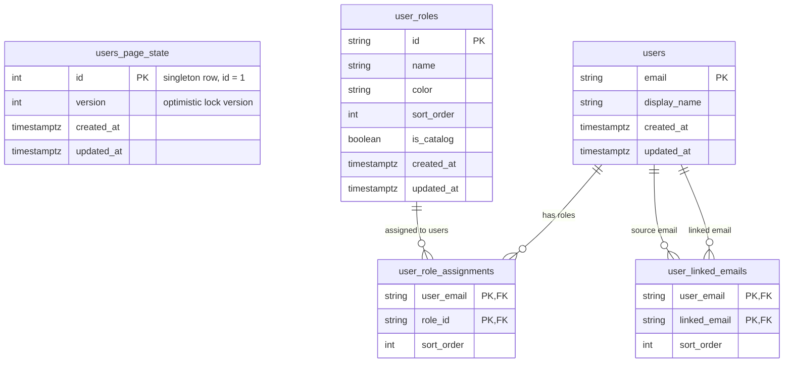

# Users State Database

Сервис хранит состояние страницы пользователей в нормализованной реляционной схеме. Внешний API по-прежнему отдаёт и принимает единый `UserPageState`, но внутри данные разложены по таблицам пользователей, ролей и связей.

## Tables

| Table | Purpose |
| --- | --- |
| `users_page_state` | Singleton metadata row for the whole state. Stores `version` for optimistic locking. |
| `users` | Known user emails and optional display names from `userNames`. |
| `user_roles` | Role catalog and role metadata. `is_catalog = true` means the role appears in top-level `roles`; assigned-only roles can be stored with `is_catalog = false`. |
| `user_role_assignments` | Many-to-many relation between users and roles, preserving per-user role order with `sort_order`. |
| `user_linked_emails` | Self-referential user email links, preserving link order with `sort_order`. |

## Migration

Migration `002_relational_users_page_state` creates the relational tables, copies data from the old JSONB columns in `users_page_state`, and then drops `roles`, `user_roles`, `user_names`, and `linked_emails` from the singleton table.

Startup runs `alembic upgrade head`, so existing deployments migrate on first service launch after the new version is deployed.
